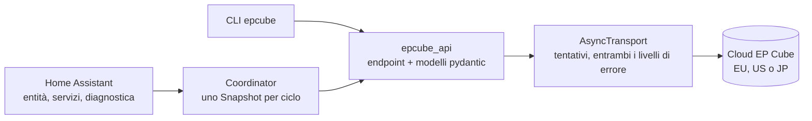

<p align="center">
    <h1>EP Cube</h1>
    <b>Un'integrazione Home Assistant per le batterie domestiche EP Cube, costruita su un client Python asincrono che raggiunge tutta l'API cloud non documentata: storico a cinque minuti, telemetria solare per stringa e una lettura misurata della potenza della batteria.</b>
    <br />
    <br />
</p>

[English](README.md) | Italiano

L'app ufficiale di EP Cube comunica con un'API cloud non documentata. Questo progetto legge quell'API come si deve, comprese le parti che nessun'altra integrazione tocca, e la trasforma in entità, controlli e servizi di Home Assistant per un sistema EP Cube.

Sono due cose in un solo repository: un'integrazione Home Assistant con config flow, un unico coordinator e diagnostica oscurata, e `epcube_api`, un client asincrono completamente tipizzato con la sua riga di comando. L'integrazione è uno strato sottile sopra il client, e il client è utile anche da solo.

Installala tramite [HACS](#installazione), oppure scarica `epcube.zip` dalla [pagina delle release](https://github.com/lowsbarrel/epcube-ha/releases/latest).

Indice:

- [Funzionalità](#funzionalità)
- [Installazione](#installazione)
- [Primi passi](#primi-passi)
  - [Dashboard Energia](#dashboard-energia)
  - [Servizi](#servizi)
  - [Il client e la CLI](#il-client-e-la-cli)
  - [L'unica trappola da conoscere](#lunica-trappola-da-conoscere)
- [Compilare dai sorgenti](#compilare-dai-sorgenti)
- [Architettura](#architettura)
- [Contribuire](#contribuire)
- [Sicurezza](#sicurezza)
- [Licenza](#licenza)

## Funzionalità

- **Potenza in tempo reale** - Solare, rete, carico della casa, carichi di backup e non di backup, potenza e stato di carica della batteria. Un solo coordinator alimenta ogni entità, quindi aggiungere entità non costa richieste in più.

- **Potenza della batteria misurata** - L'endpoint in tempo reale non riporta la potenza della batteria, quindi le altre integrazioni la ricavano da solare, rete e carico, con decine di watt di rumore anche a riposo. La serie temporale a cinque minuti la riporta direttamente, e il sensore indica la fonte usata nell'attributo `source`.

- **Solare per stringa** - Tensione, corrente e potenza per ogni ingresso MPPT, create a partire da ciò che riporta l'inverter, così una stringa in ombra o guasta si vede subito.

- **Dashboard Energia** - Solare, prelievo e immissione in rete, consumo della casa dal contatore del dispositivo, energia caricata e scaricata dalla batteria (derivata) e totali di sempre facoltativi, tutti come normali sensori `total_increasing` che accettano un prezzo fisso.

- **Controlli** - Modalità operativa (autoconsumo, fasce orarie, backup), livelli di riserva per autoconsumo e backup, e ricarica dalla rete. Ogni scrittura porta con sé la configurazione completa del dispositivo, quindi cambiare un'impostazione non ne azzera mai un'altra.

- **Override della batteria** - Forza la carica, forza la scarica o mantieni la batteria per una durata stabilita; al termine viene ripristinata la riserva di autoconsumo precedente, anche dopo un riavvio, e un ripristino fallito viene ritentato.

- **Stato** - Indicatori di connessione, guasto, allarme e blackout, numero di blackout e ultimo blackout, ultima connessione, rete Wi-Fi e livello del segnale.

- **Diagnostica** - Un download oscurato con le ultime 25 chiamate all'API e le sezioni degradate.

- **Un client completo** - `epcube_api` copre **118 route** recuperate dall'app Android, con modelli pydantic da un capo all'altro e una riga di comando `epcube` per stato, serie, fotovoltaico per stringa e chiamate grezze.

## Installazione

Servono Home Assistant 2026.3 o successivo e un account EP Cube.

|Metodo|Come|
|---|---|
|**HACS** (consigliato)|[](https://my.home-assistant.io/redirect/hacs_repository/?owner=lowsbarrel&repository=epcube-ha&category=integration) oppure aggiungi `lowsbarrel/epcube-ha` come repository personalizzato di tipo *Integration*, installa e riavvia|
|**Manualmente**|Estrai `epcube.zip` dall'[ultima release](https://github.com/lowsbarrel/epcube-ha/releases/latest) in `config/custom_components/epcube/` e riavvia|

Copiare `custom_components/epcube/` direttamente dai sorgenti non funziona: lo zip della release include il client, i sorgenti lo tengono separato.

## Primi passi

Apri **Impostazioni → Dispositivi e servizi → Aggiungi integrazione → EP Cube**:

1. **Scegli la regione.** Un account vive su un solo cluster: EU, US o JP. Un token della regione sbagliata viene rifiutato come *"token expired"*, esattamente come un token scaduto davvero, quindi controlla la regione per prima cosa quando l'accesso fallisce.
2. **Accedi o incolla un token.** Email e password funzionano quando sono installate le dipendenze del risolutore CAPTCHA; altrimenti incolla un token, che `uv run epcube login --save` genera per te.
3. **Regola le opzioni.** La parte in tempo reale si aggiorna ogni 60 secondi; dettagli del dispositivo, blackout e storico a cinque minuti ogni 30 minuti; i totali mensili, annuali e di sempre restano spenti finché non li attivi.

Quando un token scade, Home Assistant ne chiede uno nuovo; nient'altro va riconfigurato.

### Dashboard Energia

Apri **Impostazioni → Plance → Energia** e imposta le fonti:

|Fonte della dashboard|Sensore|
|---|---|
|Produzione solare|**Solar today**|
|Prelievo dalla rete|**Grid import today**|
|Immissione in rete|**Grid export today**|
|Energia in ingresso nella batteria|**Battery charged**|
|Energia in uscita dalla batteria|**Battery discharged**|

L'API lascia a zero i propri contatori di energia della batteria, quindi **Battery charged** e **Battery discharged** vengono ricavati dal livello di energia accumulata a ogni aggiornamento; un intervallo di aggiornamento più breve li rende più precisi. Lo storico parte dal momento dell'installazione: non c'è un recupero dei dati passati.

### Servizi

|Servizio|Cosa fa|
|---|---|
|`epcube.set_operating_mode`|Cambia modalità, impostando facoltativamente la riserva di quella modalità|
|`epcube.set_tou_schedule`|Scrive il calendario delle fasce; le liste omesse mantengono il valore attuale|
|`epcube.force_charge`|Carica fino a un livello obiettivo alzando la riserva, per una durata|
|`epcube.force_discharge`|Lascia che la batteria alimenti la casa fino a un livello obiettivo|
|`epcube.hold_battery`|Mantiene la batteria al livello attuale|
|`epcube.clear_override`|Termina qualsiasi override e ripristina la riserva di autoconsumo precedente|

### Il client e la CLI

```python
import asyncio

from epcube_api import EpCubeAsyncClient, Scope, WorkMode


async def main() -> None:
    async with EpCubeAsyncClient(region="EU", token="…") as client:
        snap = await client.snapshot()
        print(snap.summary_line())

        series = await client.data.series(snap.dev_id, Scope.DAY)
        for when, watts in series.timeline("battery_power_w"):
            print(when, watts)

        config = await client.device.mode(snap.dev_id)
        await client.device.set_mode(config, WorkMode.BACKUP)


asyncio.run(main())
```

Lo stesso client guida la riga di comando:

```bash
uv sync --extra login
cp .env.example .env
uv run epcube login --save
uv run epcube status
```

```
EP Cube 1234  (EU)
  SoC 93%  solar 384W  grid 0W  load 22W  battery +362W  Self-consumption

  battery power                  +362 W  (measured)
  pv string 1                    185.8 V  7.9 A  1460 W
  pv string 2                    283.0 V  8.5 A  2430 W
  outages logged                 1
```

`epcube series` stampa le curve a qualsiasi scala, `epcube pv` le stringhe, `epcube routes` tutta la superficie dell'API e la sua copertura, e `epcube probe <path>` chiama una route che non ha ancora un wrapper.

### L'unica trappola da conoscere

`device/switchMode` tratta un campo **assente** dal payload come *riporta questo al valore predefinito*. Invia `{"devId": …, "workStatus": "3"}` per passare in modalità backup e il dispositivo perde anche il calendario delle fasce ed entrambi i livelli di riserva.

Per questo una scrittura è un modello, mai un dizionario. `SwitchModeRequest` dichiara ogni campo che l'endpoint conosce e si costruisce da una lettura fresca, il che rende un payload parziale impossibile da esprimere:

```python
config = await client.device.mode(dev_id)
request = SwitchModeRequest.from_config(config).with_changes(self_consumption_reserve_soc="25")
await client.device.switch_mode(request)
```

## Compilare dai sorgenti

Serve [uv](https://docs.astral.sh/uv/); installa da solo Python 3.14 leggendo `.python-version`.

```bash
git clone https://github.com/lowsbarrel/epcube-ha.git
cd epcube-ha
uv sync --all-extras
git config core.hooksPath .githooks
```

`sh scripts/build-release.sh` produce `epcube.zip`, l'integrazione con il client incluso al suo interno. Prima di aprire una pull request, esegui la verifica completa, la stessa che eseguono l'hook di pre-commit e la CI:

```bash
sh scripts/verify.sh
```

Cerca segreti, applica le regole su dimensione dei file e commenti, ed esegue ruff, pyrefly (strict) e pytest con copertura del 100% di istruzioni e rami. Vedi [AGENTS.md](AGENTS.md) per le convenzioni di sviluppo, strumenti e verifica.

## Architettura



L'integrazione non parla mai direttamente con l'API. Un coordinator chiede al client uno `Snapshot` per ciclo, leggendo la parte in tempo reale a ogni intervallo di aggiornamento e le letture pesanti su un ciclo più lento, e ogni entità legge da quello snapshot. Solo la lettura in tempo reale può far fallire un ciclo; una lettura supplementare che fallisce viene registrata negli errori dello snapshot, così una route statistica lenta non trascina mai con sé i dati in tempo reale.

Il client è solo asincrono e tipizzato da un capo all'altro. Il suo transport gestisce i nuovi tentativi ed entrambi i livelli di errore dell'API: il cluster EU usa i codici di stato HTTP, mentre US e JP rispondono HTTP 200 con il codice reale nel corpo. Maggiori dettagli in [docs/architecture.md](docs/architecture.md), e l'inventario completo delle route è in [docs/api-endpoints.md](docs/api-endpoints.md).

## Contribuire

I contributi sono benvenuti, ed estendere la copertura dell'API risparmia alla prossima persona un altro smontaggio dell'APK. Lavora su un branch a partire da `main` e apri una pull request: la CI controlla Conventional Commits, segreti, dimensione dei file e commenti, ruff, pyrefly, test con copertura al 100%, hassfest e il pacchetto di release, e i titoli seguono [Conventional Commits](https://www.conventionalcommits.org/). [AGENTS.md](AGENTS.md) descrive come è organizzato il codice e cosa significa "finito"; [docs/](docs/README.md) contiene le spiegazioni estese.

## Sicurezza

- L'integrazione parla solo con il cloud EP Cube della tua regione; non ci sono altri server né telemetria.
- Il token di accesso sta nella config entry di Home Assistant; la CLI lo legge dall'ambiente o da un `.env` escluso da git.
- L'API restituisce nome, indirizzo, coordinate GPS ed email del proprietario su diversi endpoint. Il download della diagnostica li oscura; un `epcube --json status` o un `probe` grezzo no.

Segnala le vulnerabilità in privato tramite un [avviso di sicurezza su GitHub](https://github.com/lowsbarrel/epcube-ha/security/advisories/new) invece che con una issue pubblica.

## Licenza

Questo repository è distribuito con [licenza MIT](LICENSE).

Non ufficiale, e non affiliato a EP Cube, Canadian Solar o CSI Solar. L'API non è documentata e può cambiare senza preavviso.
