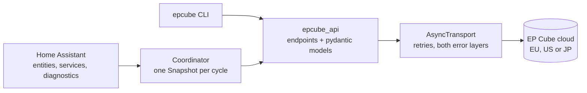

<p align="center">
    <h1>EP Cube</h1>
    <b>A Home Assistant integration for EP Cube home batteries, built on an async Python client that reaches the whole undocumented cloud API: five-minute history, per-string solar telemetry and a measured battery power reading.</b>
    <br />
    <br />
</p>

English | [Italiano](README-IT.md)

EP Cube's official app talks to an undocumented cloud API. This project reads that API properly, including the parts no other integration touches, and turns it into Home Assistant entities, controls and services for one EP Cube system.

It is two things in one repository: a Home Assistant integration with a config flow, a single coordinator and redacted diagnostics, and `epcube_api`, a fully typed async client with its own command line. The integration is a thin layer over the client, and the client is useful on its own.

Install it through [HACS](#installation), or download `epcube.zip` from the [releases page](https://github.com/lowsbarrel/epcube-ha/releases/latest).

Table of Contents:

- [Features](#features)
- [Installation](#installation)
- [Getting Started](#getting-started)
  - [Energy dashboard](#energy-dashboard)
  - [Services](#services)
  - [The client and CLI](#the-client-and-cli)
  - [The one trap worth knowing](#the-one-trap-worth-knowing)
- [Building from Source](#building-from-source)
- [Architecture](#architecture)
- [Contributing](#contributing)
- [Security](#security)
- [License](#license)

## Features

- **Live power** - Solar, grid, house load, backup and non-backup loads, battery power and state of charge. One coordinator feeds every entity, so adding entities costs no extra requests.

- **Measured battery power** - The live endpoint does not report battery power, so other integrations infer it from solar, grid and load, with tens of watts of noise even at rest. The five-minute time series reports it directly, and the sensor names its source in a `source` attribute.

- **Per-string solar** - Voltage, current and power for each MPPT input, created from whatever the inverter reports, so a shaded or failing string is visible.

- **Energy dashboard** - Solar, grid import and export, house consumption from the device's own meter, derived battery charged and discharged, and optional lifetime totals, all as standard `total_increasing` sensors that accept a fixed price.

- **Controls** - Operating mode (self-consumption, time of use, backup), self-consumption and backup reserve levels, and charge from grid. Every write carries the complete device configuration, so changing one setting never resets another.

- **Battery overrides** - Force charge, force discharge or hold the battery for a set duration; the previous reserve is restored afterwards, even across a restart.

- **Health** - Online, fault, alert and grid outage indicators, outage count and last outage, last connection, Wi-Fi network and signal level.

- **Diagnostics** - A redacted download with the last 25 API calls and which sections were degraded.

- **A complete client** - `epcube_api` covers **118 routes** recovered from the Android app, with pydantic models end to end and an `epcube` command line for status, series, per-string PV and raw probes.

## Installation

You need Home Assistant 2026.3 or later and an EP Cube account.

|Method|How|
|---|---|
|**HACS** (recommended)|[](https://my.home-assistant.io/redirect/hacs_repository/?owner=lowsbarrel&repository=epcube-ha&category=integration) or add `lowsbarrel/epcube-ha` as a custom repository of type *Integration*, install, then restart|
|**Manually**|Unpack `epcube.zip` from the [latest release](https://github.com/lowsbarrel/epcube-ha/releases/latest) into `config/custom_components/epcube/` and restart|

Copying `custom_components/epcube/` straight from the source tree does not work: the release zip carries the client inside it, the source tree keeps it separate.

## Getting Started

Open **Settings → Devices & Services → Add Integration → EP Cube**:

1. **Pick the region.** An account lives on exactly one cluster: EU, US or JP. A token from the wrong one is rejected as *"token expired"*, exactly like a genuinely expired token, so check the region first when sign-in fails.
2. **Sign in or paste a token.** Email and password work when the CAPTCHA solver's dependencies are installed; otherwise paste a token, which `uv run epcube login --save` mints for you.
3. **Tune the options.** The live tier refreshes every 60 seconds; device details, outages and the five-minute history refresh every 30 minutes; monthly, yearly and lifetime totals are off until you turn them on.

When a token expires, Home Assistant asks for a new one; nothing else needs reconfiguring.

### Energy dashboard

Open **Settings → Dashboards → Energy** and set the sources:

|Dashboard source|Sensor|
|---|---|
|Solar production|**Solar today**|
|Grid consumption|**Grid import today**|
|Return to grid|**Grid export today**|
|Battery in|**Battery charged**|
|Battery out|**Battery discharged**|

The API leaves its battery energy counters at zero, so **Battery charged** and **Battery discharged** are derived from the stored-energy level on every refresh; a shorter update interval makes them more accurate. History starts when you install the integration: there is no backfill.

### Services

|Service|What it does|
|---|---|
|`epcube.set_operating_mode`|Switches mode, optionally setting that mode's reserve level|
|`epcube.set_tou_schedule`|Writes the tariff calendar; lists left out keep their current value|
|`epcube.force_charge`|Charges to a target level by raising the reserve, for a duration|
|`epcube.force_discharge`|Lets the battery supply the house down to a target level|
|`epcube.hold_battery`|Holds the battery at its current level|
|`epcube.clear_override`|Ends any override and restores the previous settings|

### The client and CLI

```python
import asyncio

from epcube_api import EpCubeAsyncClient, Scope, WorkMode


async def main() -> None:
    async with EpCubeAsyncClient(region="EU", token="…") as client:
        snap = await client.snapshot()
        print(snap.summary_line())

        series = await client.data.series(snap.dev_id, Scope.DAY)
        for when, watts in series.timeline("battery_power_w"):
            print(when, watts)

        config = await client.device.mode(snap.dev_id)
        await client.device.set_mode(config, WorkMode.BACKUP)


asyncio.run(main())
```

The same client drives the command line:

```bash
uv sync --extra login
cp .env.example .env
uv run epcube login --save
uv run epcube status
```

```
EP Cube 1234  (EU)
  SoC 93%  solar 384W  grid 0W  load 22W  battery +362W  Self-consumption

  battery power                  +362 W  (measured)
  pv string 1                    185.8 V  7.9 A  1460 W
  pv string 2                    283.0 V  8.5 A  2430 W
  outages logged                 1
```

`epcube series` prints curves at any scope, `epcube pv` the strings, `epcube routes` the whole API surface and its coverage, and `epcube probe <path>` calls a route that has no wrapper yet.

### The one trap worth knowing

`device/switchMode` treats a field that is **absent** from the payload as *reset this to default*. Send `{"devId": …, "workStatus": "3"}` to switch to backup mode and the device also loses its tariff calendar and both reserve levels.

So a write is a model, never a dict. `SwitchModeRequest` declares every field the endpoint understands and is built from a fresh read, which makes a partial payload unrepresentable:

```python
config = await client.device.mode(dev_id)
request = SwitchModeRequest.from_config(config).with_changes(self_consumption_reserve_soc="25")
await client.device.switch_mode(request)
```

## Building from Source

Building requires [uv](https://docs.astral.sh/uv/); it installs Python 3.14 from `.python-version` on its own.

```bash
git clone https://github.com/lowsbarrel/epcube-ha.git
cd epcube-ha
uv sync --all-extras
git config core.hooksPath .githooks
```

`sh scripts/build-release.sh` produces `epcube.zip`, the integration with the client vendored inside it. Before opening a pull request, run the verification bar, which the pre-commit hook and CI run too:

```bash
sh scripts/verify.sh
```

It scans for secrets, enforces the file-size and comment rules, and runs ruff, pyrefly (strict) and pytest at 100% statement and branch coverage. See [AGENTS.md](AGENTS.md) for engineering, tooling and verification conventions.

## Architecture



The integration never talks to the API itself. A coordinator asks the client for one `Snapshot` per cycle, reading the live tier every update interval and the heavy reads on a slower loop, and every entity reads from that snapshot. Only the live read may fail a cycle; a supplementary read that fails is recorded in the snapshot's errors, so one slow statistics route never takes the live data down with it.

The client is async-only and typed end to end. Its transport handles retries and both of the API's error layers: the EU cluster uses HTTP status codes, while US and JP answer HTTP 200 with the real code in the body. More detail is in [docs/architecture.md](docs/architecture.md), and the full route inventory is in [docs/api-endpoints.md](docs/api-endpoints.md).

## Contributing

Contributions are welcome, and extending the API coverage saves the next person another APK teardown. Work on a branch off `main` and open a pull request: CI checks Conventional Commits, secrets, file size and comments, ruff, pyrefly, tests at 100% coverage, hassfest and the release bundle, and titles follow [Conventional Commits](https://www.conventionalcommits.org/). [AGENTS.md](AGENTS.md) describes how the code is organised and what "done" means; [docs/](docs/README.md) holds the long-form explanations.

## Security

- The integration talks only to the EP Cube cloud for your region; there is no other server and no telemetry.
- The access token lives in Home Assistant's config entry; the CLI reads it from your environment or a gitignored `.env`.
- The API returns the owner's name, address, GPS coordinates and email on several endpoints. The diagnostics download redacts them; a raw `epcube status --json` or `probe` does not.

Please report vulnerabilities privately through a [GitHub security advisory](https://github.com/lowsbarrel/epcube-ha/security/advisories/new) rather than a public issue.

## License

This repository is available under the [MIT License](LICENSE).

Unofficial, and unaffiliated with EP Cube, Canadian Solar or CSI Solar. The API is undocumented and may change without notice.
